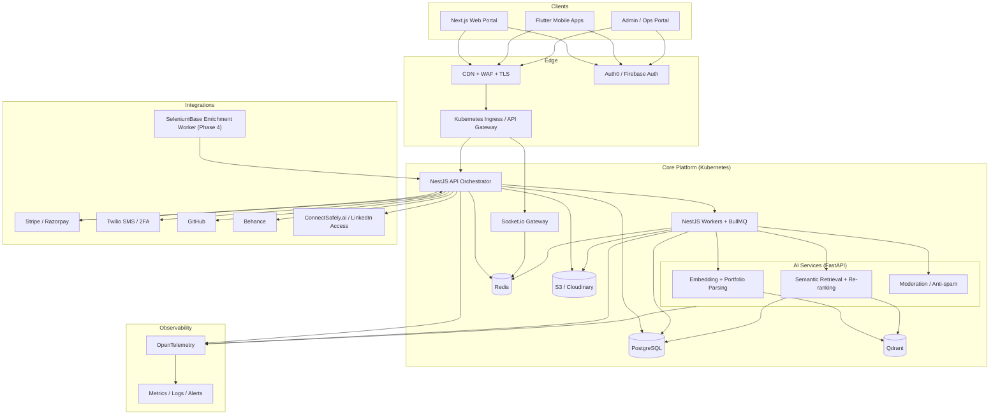
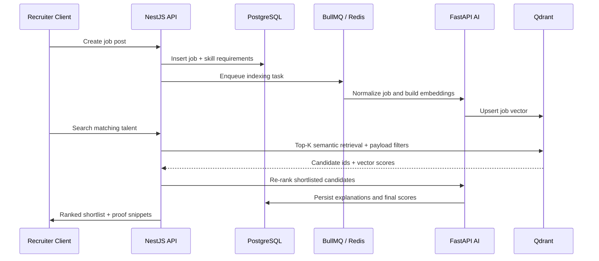
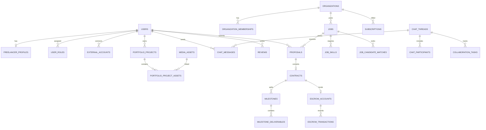

# AI Freelance Marketplace System Architecture

## Scope

This baseline targets a production-ready, portfolio-first freelance marketplace with:

- Next.js web
- Flutter mobile
- NestJS API orchestration
- FastAPI AI microservices
- PostgreSQL as the system of record
- Qdrant for semantic retrieval
- Redis for caching, sessions, queues, and Socket.io scaling
- Stripe or Razorpay for payments and escrow rails
- S3 or Cloudinary for media storage

Assumption: Auth0 is the default identity provider because it simplifies RBAC, B2B memberships, and JWT-based service boundaries. Firebase Auth can be swapped in without changing the core database design.

## High-Level Architecture

## Core Service Boundaries

| Layer | Responsibility | Notes |
|---|---|---|
| Next.js | Public marketplace, dashboards, employer console | SSR for SEO, Tailwind UI, signed upload URLs |
| Flutter | Mobile talent and recruiter workflows | Reuses NestJS APIs and Socket.io events |
| NestJS API | AuthZ, business rules, billing, escrow, chat, orchestration | System of action and canonical API boundary |
| FastAPI AI | Embeddings, portfolio parsing, retrieval orchestration, re-ranking, moderation | Compute-isolated from transactional API |
| PostgreSQL | Users, jobs, proposals, contracts, subscriptions, chat, ledger | Source of truth |
| Qdrant | Fast semantic retrieval for jobs and talent | Denormalized search layer only |
| Redis | Cache, rate limit, BullMQ, Socket.io pub/sub | No durable source of truth |
| S3 / Cloudinary | Reels, thumbnails, docs, deliverables | Store only references in PostgreSQL |

## Matching Pipeline

The matching engine should use dedicated embedding models for vector generation and an LLM for normalization, explanation, and re-ranking. Do not use a general chat model directly as the embedding engine.

### Similarity Baseline

\[
S(J, P) = \frac{\mathbf{v}_J \cdot \mathbf{v}_P}{\|\mathbf{v}_J\| \|\mathbf{v}_P\|}
\]

### Two-Stage Retrieval

1. A recruiter creates or updates a job.
2. NestJS persists the job in PostgreSQL.
3. A BullMQ worker sends normalized job content to FastAPI.
4. FastAPI extracts skills, budget, location, and portfolio-proof requirements, then generates embeddings.
5. The job vector is upserted into Qdrant.
6. Candidate discovery queries Qdrant for the top N talent profiles with payload filters for hard constraints.
7. FastAPI re-ranks the shortlisted set using:
   - cosine similarity
   - skill overlap
   - portfolio evidence quality
   - subscription visibility boost
   - trust score
   - response rate
   - verified badge status
8. NestJS stores the ranked output in PostgreSQL for explainability, audit, and recruiter review.

### Matching Sequence

## Portfolio-First Ingestion Model

Portfolio quality is the main differentiator, so the ingestion pipeline indexes more than profile text:

- project summaries
- reel transcripts
- image OCR / alt-text
- GitHub repo metadata and README summaries
- Behance case study summaries
- completed contract outcomes and ratings

Each portfolio item remains canonical in PostgreSQL, while Qdrant stores denormalized vectors and filter payloads for fast retrieval.

## Payments and Escrow

The payment subsystem is split into three layers:

1. Business contract state in PostgreSQL
2. Provider orchestration in NestJS
3. External movement of funds in Stripe or Razorpay

Milestone approvals, releases, refunds, disputes, and fee calculations are recorded in PostgreSQL even when the actual hold and release happen through the provider.

## Smart Collaboration Hub

Smart Chat is implemented with Socket.io and backed by PostgreSQL plus Redis:

- PostgreSQL stores durable threads, messages, attachments, task records, and read state
- Redis powers fan-out, presence, and Socket.io adapter scaling
- S3 or Cloudinary stores transferred files

## Security and Compliance Baseline

- JWT verification at the NestJS edge, with role- and resource-based authorization
- signed upload URLs for media ingestion
- private media bucket plus CDN tokenization for restricted assets
- KMS-backed secret storage
- audit logs for financial and moderation actions
- KYC / verified badge workflow recorded in PostgreSQL
- consent and policy-version tracking for GDPR readiness
- isolated enrichment worker namespace for SeleniumBase and third-party scraping controls

## Deployment Baseline

- Next.js in a container behind CDN and WAF
- NestJS API and workers on Kubernetes
- FastAPI AI services on Kubernetes with autoscaling separated from transactional APIs
- PostgreSQL on AWS RDS or Google Cloud SQL
- Redis on ElastiCache or Memorystore
- Qdrant as managed cloud or a dedicated stateful deployment
- GitHub Actions for CI/CD, image builds, migrations, and rollout gates

## Core ER Overview

